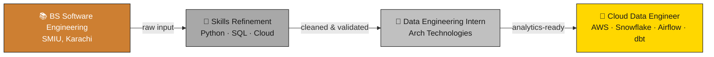

<div align="center">


</div>

<div align="center">

<a href="https://linkedin.com/in/naveed-jokhio"></a>
<a href="https://github.com/Naveedjokhio"></a>
<a href="https://naveedjokhio.netlify.app"></a>
<a href="mailto:naveedjokhio243@gmail.com"></a>

</div>

<br>

## 🥉🥈🥇 My Journey, Mapped to a Medallion Pipeline



> 💡 Just like a Bronze → Silver → Gold pipeline transforms raw data into business-ready insights, I'm on a journey from foundational learning to building production-grade cloud data systems.

---

## 🧑‍💻 About Me

```python
class NaveedJokhio:
    def __init__(self):
        self.role        = "Aspiring Cloud Data Engineer"
        self.education   = "BS Software Engineering, SMIU (2023 - 2027)"
        self.experience  = "Data Engineering Intern @ Arch Technologies"
        self.stack       = ["Python", "SQL", "AWS", "Snowflake", "dbt", "Airflow", "Docker", "Power BI"]
        self.focus       = ["ETL/ELT", "Medallion Architecture", "Star Schema", "SCD Type-2"]
        self.location    = "Karachi, Pakistan 🇵🇰"
        self.open_to     = "Data Engineering Internships & Full-Time Roles"

    def say_hi(self):
        print("Thanks for stopping by — let's build something data-driven! 🚀")
```

---

## 🛠️ Tech Arsenal

<table align="center">
<tr>
<td valign="top" width="50%">

**Languages & Querying**
<br>


**Cloud Platform (AWS)**
<br>


**Data Warehousing**
<br>


</td>
<td valign="top" width="50%">

**Orchestration & Transformation**
<br>


**Data Processing & Viz**
<br>


**Core Concepts**
<br>


</td>
</tr>
</table>

---

## 🚀 Featured Pipelines

<details open>
<summary><b>✈️ Flight Operations Analytics Pipeline</b> — Apache Airflow · Snowflake · Docker · Power BI</summary>
<br>

Production-grade **batch pipeline** ingesting live flight data from the **OpenSky Network API** every 30 minutes via an Airflow DAG.

- 🥉 **Bronze → 🥈 Silver → 🥇 Gold** medallion architecture across 4 modular tasks
- ♻️ Retry logic & idempotent task design for reliable scheduling
- 📊 Gold-layer KPIs (air traffic volume, congestion signals, country-level activity) loaded into Snowflake via **UPSERT**
- 🐳 Fully Dockerized with `docker-compose`, visualized in **Power BI**

`Apache Airflow` `Python` `Snowflake` `Docker` `Power BI` `OpenSky API`

</details>

<details open>
<summary><b>🏨 End-to-End Hotel Booking Data Pipeline</b> — 100% Snowflake-Native</summary>
<br>

A complete hotel booking data pipeline built **entirely inside Snowflake** using Medallion Architecture.

- 🥉 **Bronze**: Raw booking ingestion
- 🥈 **Silver**: SQL transformations fixing invalid emails, negative amounts & status typos
- 🥇 **Gold**: Aggregation tables powering an interactive **Snowsight dashboard** with KPIs, trend charts & booking breakdowns

`Snowflake` `SQL` `Medallion Architecture` `Snowsight`

</details>

<details>
<summary><b>🏠 End-to-End Airbnb Data Pipeline</b> — AWS S3 · Snowflake · dbt · Airflow</summary>
<br>

Cloud-native **ELT pipeline** with Medallion Architecture (Bronze → Silver → Gold), incremental dbt models, **SCD Type-2** snapshots, and a Star Schema (fact/dimension tables) enforced via dbt schema tests.

`AWS S3` `Snowflake` `dbt` `Airflow` `SCD Type-2` `Star Schema`

</details>

<details>
<summary><b>⚡ AWS Serverless ETL Pipeline</b> — S3 · Lambda · Glue · Athena</summary>
<br>

Event-driven, **serverless ETL pipeline** converting raw JSON into columnar **Parquet**, cutting storage costs by ~40%. Schema inference automated via AWS Glue Crawlers with modular Lambda functions and S3 partitioning.

`AWS S3` `Lambda` `Glue` `Athena` `Python` `Parquet`

</details>

---

## 💼 Experience

**Data Engineering Intern** · Arch Technologies · *Jan 2026 – Mar 2026* · Remote

- 🔧 Built end-to-end ETL pipelines in Python (Pandas, NumPy) — **↓30%** data prep time
- ✅ Automated data validation & quality checks — **↑20%** data accuracy
- 🧹 Standardized datasets across pipelines — **↑25%** data reliability

---

## 🎓 Education & Certifications

| 🏛️ Program | Institution | Years |
|---|---|---|
| BS Software Engineering | Sindh Madressatul Islam University (SMIU), Karachi | 2023 – 2027 |
| Intermediate (Pre-Engineering) | Govt. Boys Degree College, Naudero | 2019 – 2021 |

<div align="center">


</div>

---

## 📊 GitHub Analytics

<div align="center">


<br><br>


</div>

---

<div align="center">

### 🤝 Let's Build the Next Gold-Layer Pipeline Together

*Open to Data Engineering internships, full-time roles & collaborations*

<a href="https://linkedin.com/in/naveed-jokhio"></a>


</div>
